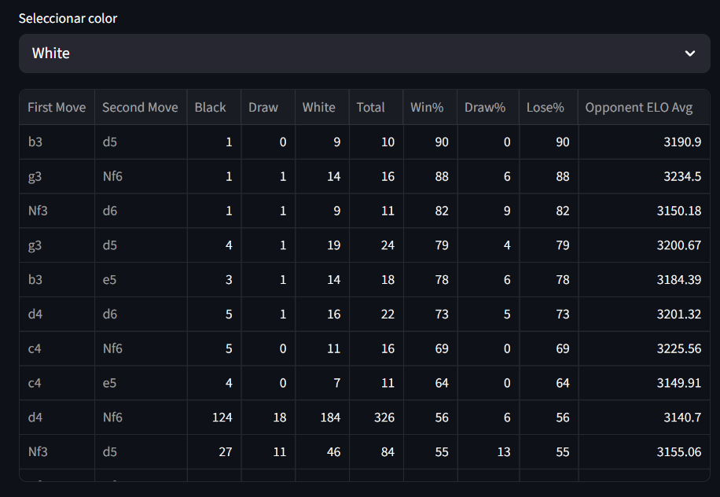

# Magnus Carlsen Opening Analysis

Analysis of Magnus Carlsen's (DrNykterstein) last 2000 Lichess games, exploring his results by opening depending on the color he plays.



## What it shows

For each combination of first and second move (with at least 10 games), the app displays:
- Number of wins, draws and losses
- Win%, Draw% and Loss%
- Average opponent ELO

## How to run

```bash
pip install -r requirements.txt
streamlit run magnus_openings.py
```

Then open your browser at `http://localhost:8501`, select white or black and wait for the data to load (~1-2 minutes the first time; results are cached for an hour).

## Tech stack

- Python
- Lichess API
- pandas
- Streamlit
